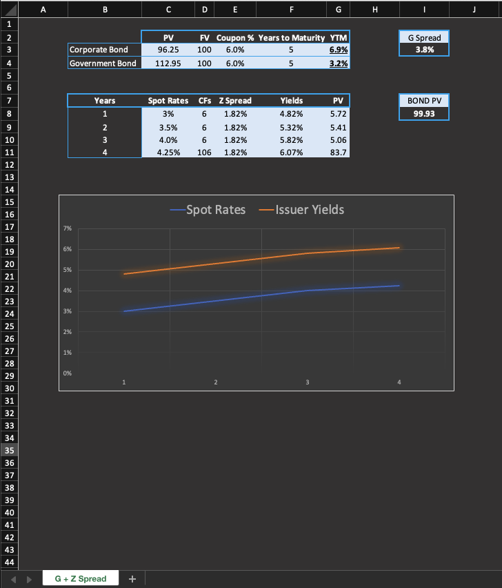

# z_g_spread_bond_calculator

- This project calculates key fixed income metrics, including Z-Spread (zero volatility spread), G-Spread (government spread), and the present value of risk-free bonds.

---

## Files
- `z_g_spread_bond_calculator.xlsx`: Spreadsheet containing calculations for Z-Spread, G-Spread, and risk-free bond present values, along with visualizations.
- `plot.png`: Plot.

## Screenshots

